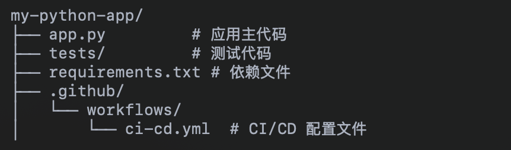
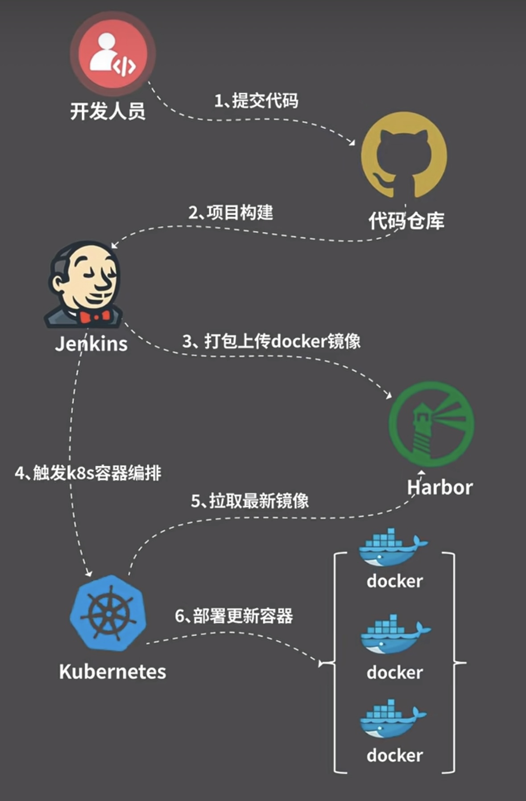

# 1 什么是流水线

在 **CI/CD**（持续集成/持续交付）中，**Pipeline** 是一个定义一系列步骤和流程的自动化工作流，描述了从代码提交到应用部署整个过程的每一步。它本质上是一个任务序列，通常包括代码构建、测试、代码分析、打包、部署等阶段。

# 2 什么是CI/CD

**CI/CD** 是软件开发流程中的两个重要概念：

1. **CI（Continuous Integration，持续集成）**：

- 指开发者在代码提交后，自动化工具会运行一系列的流程，比如编译、测试、代码质量检查等，以确保新代码能与现有代码兼容。

- 目标是尽早发现问题，避免代码冲突。

2. **CD（Continuous Delivery/Continuous Deployment，持续交付/持续部署）**：

- 持续交付：自动将通过测试的代码部署到预生产环境，人工确认后发布到生产环境。

- 持续部署：全流程自动化，通过测试的代码直接发布到生产环境。

> 示例：
>
> 1. **代码提交**：当开发者将代码推送到主分支时，GitHub Actions 自动触发 CI/CD 流程。
>
> 2. **CI 阶段**：
>    - **运行测试**：pytest 检查代码功能是否正确。
>    - **静态代码分析**：使用 Semgrep 检查潜在的安全漏洞和质量问题。
>    - 如果任何测试或分析失败，流程会停止并通知开发者。
>
> 3. **CD 阶段**：如果 CI 阶段通过，系统会自动将代码部署到生产环境。

# 3 Jenkins是干嘛的

Jenkins类似GitHub Actions，它们都是用来自动化执行 CI/CD 流程的工具。两者都支持自动化代码构建、测试、部署以及其他自定义任务

## Jenkins和GitHub Actions区别

**Jenkins 流程**

1. 自行托管 Jenkins 服务器。
2. 配置构建节点以适配代码库和所需环境。
3. 编写 Jenkinsfile 定义构建、测试、静态代码分析和部署步骤。
4. 触发流程时，Jenkins 自动从代码仓库（可能是 GitHub）拉取代码，执行流水线任务。

**GitHub Actions 流程**

1. 项目代码托管在 GitHub。

2. 在 .github/workflows/ 下编写 YAML 文件定义工作流。

   

3. 每当触发器（如代码推送或 PR）被触发，GitHub Actions 会自动启动相应的工作流并运行任务。

